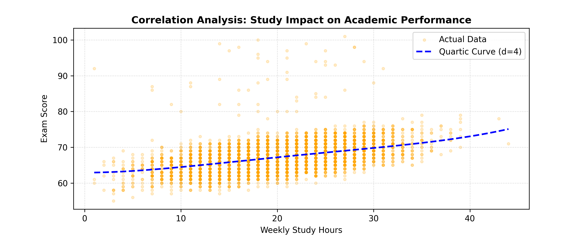

# 🎓 Student Performance Predictor (BYOP)

### Project Overview
This project was developed for the **Fundamentals of AI and ML** course at VIT Bhopal. It uses machine learning to predict student exam scores based on behavioral and academic factors.

###  Features Used
* **Weekly Study Hours:** Time spent in self-study.
* **Attendance:** Percentage of classes attended.
* **Previous Scores:** Baseline academic performance.
* **Tutoring Sessions:** Extra academic support received.

###  Technical Implementation
* **Model Type:** Quartic (Degree 4) Polynomial Regression.
* **Optimization:** Ordinary Least Squares (OLS) via Scikit-Learn.
* **Visuals:** NumPy-driven 2D representation of a 4D feature space.

###  Model Comparison
To improve accuracy, I moved from a basic **Linear Regression** to a **Degree 4 Polynomial Model**. This allowed the AI to capture "diminishing returns" in study habits, resulting in a significantly lower **Mean Squared Error (MSE)** and a higher **R² Score**.

###  How to Run
1. Ensure you have the dataset `StudentPerformanceFactors.csv` in the same directory.
2. Install dependencies: `pip install pandas numpy matplotlib scikit-learn`
3. Run the script: `python main.py`
4. Enter your details when prompted to get the model prediction.

###  Sample Visualization

---
**Developer:**Kuldeep
**Reg. No.:** 25BAI10878
**Institution:** VIT Bhopal University  
**Course:** Fundamentals of AI and ML
